- [Search algrothm](#org0c2a063)
  - [Symbol table](#org67ac41a)
    - [intro](#org46a7845)
    - [API](#org74374ec)
    - [Sample clients](#org8fe0539)
    - [Summery](#org66e02bb)
  - [Sequential search in an unordered linked list](#orgc3afa5d)
    - [implement](#orgaccfd36)
  - [Binary search in an ordered array](#orgab1abbe)
    - [Analysis of binary search](#org6b3e251)
  - [Binary search trees](#org3562fb3)
    - [Analysis](#orgc5f346a)
    - [Summary](#org251974c)
  - [Balanced Search Trees](#org72c7cc1)
    - ["2-3 search trees"](#org9f0442f)
  - [Red-black BSTs](#org632900e)
    - [Encoding 3-nodes](#orgf4473ab)
    - [An equivalent definition](#orgc63f4e8)
    - [A 1-1 correspondence](#orgb2aa4f7)
    - [color representation](#orgd40b80c)
    - [Rotations](#org73f6377)
    - [Insert into a single 2-node.](#orgfd4c139)
    - [Insert into a two node at the bottom.](#org358b925)
    - [Insert into a tree with two keys(in a 3-node)](#org6a778ee)
    - [Flipping color](#org9afb471)
    - [Keeping the root black.](#orga007f9b)
    - [Insert into a 3-node at the bottom.](#org825980f)
    - [Passing a red link up the tree.](#orge6ca549)
    - [Implement](#org534d228)
    - [Deletion](#org8c076ac)


<a id="org0c2a063"></a>

# Search algrothm


<a id="org67ac41a"></a>

## Symbol table


<a id="org46a7845"></a>

### intro

A symbol table is a data structure for key-value pairs that supports two operations: insert(put) a new pair into the table and search for (get) the value associate with a given key; Symbol table is to associate a value with a key. Like a dictionary, we can find the word which we want throuth the index. Or we can make a analogy between "symbol table" and "book index". The main purpose of then is extract the key of the content. Then we can find what we want quickly through the key.


<a id="org74374ec"></a>

### API

1.  Generic basic symbol table

    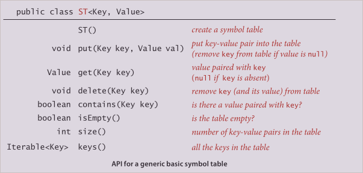

    1.  Design

        -   **Generics:** make the methods without specifying the type of the items being processed
        -   **Duplicate keys:** -   no duplicate keys in a table.
            -   When a client puts a key-value pair into a table who already containing that key(and associated a value), the new value replaces the old one.
        -   **Null keys:** keys must not be null(like the array we can\`t access the value of a array with key that\`s not exist in the array)
        -   **Null values:** no key can be associated with a null value. This conversion has two intended
            -   we can test whether or not the symbol table contains a value associated with a given key by test whether get() returns null.
            -   we can use the operation of calling put() with null as its second argument to implement deletion
        -   **Deletion:** -   **lazy deletion:** Just associate keys with null. Then perhaps remove all such keys at some later tiem.

                ```c++
                put(key,NULL)
                ```
            -   **eager deletion:** Remove the key from the table immediately
        -   **Shorthand methods:** for clarity in client code, we include the methods contains() and isEmpty() in the API we assume it to be present in all implementations of the symbol table API and use these methods freely in client code.

            

        -   **Iteration:** To enable clients to process all the key and values in the table
        -   **key equality:** Determining whether or not a given key is in a symbol table is based on the concept of object equality

2.  Ordered symbol tables

    

    1.  Design

        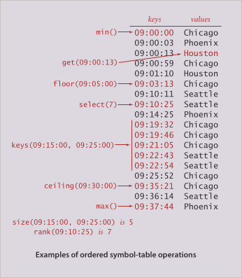 keys must be Comparable object. So, in such implementations, we can keep the keys in order.

        ```c++
        int compareTo(T foo){
            if(foo > this.foo)
                return 1;
            if(foo < this.foo)
                return -1;
            if (foo == this.foo)
                return 0;
        }
        ```

        -   **Minimum and maximum:** return the minimum key or the maximum key
        -   **Floor:** find the lagest key that is less then or equal to the given key
        -   **ceiling:** find the smallest key that is greater than or equal to the given key
        -   **Rank:** find the number of keys less than a given key
        -   **select:** find the key with a given rank(i == rank(select(i)))
        -   **Range queries:** How many keys fall within a given range(between two given key)
        -   **Exception cases:** when a methods is to return a key and there is no key fitting a description in the table,out convention is to throw an exception (an alternate approach,which is also reasonable,would be to return null in such caces). For example,min(),max(),deleteMin(),deleteMax(),floor(),and ceiling() all throw exceptions if the table is empty,as does select(k) if k is less than 0 or not less than size()
        -   **Shorthand methods:** As we have already seen with isEmpty() and contains() in out basic API,we keep some redundant methods in the API for clarity in client code.We assume that the following default implementations are included in any implementation of the ordered symbol-table API unless otherwise specified;

            

        -   **Key equality(revisited):** The best practice in Java is to make compareTo() consistent with equals() in all Comparable types. That is, for every pair of values a and b in any given Comparable type, it should be the case that (a.compareTo(b) == 0) and a.equals(b) have then same value. To avoid any potential ambiguities, we avoid the use of equals() in ordered symbol-table implementations. Instead, we use compareTo() exclusively to compare keys: we take the boolean expression a.compareTo(b)==0 to mean "Are a b equal ?"

        -   **Cost model:** Whether we use equals() (for symbol tables where keys are not Comparable) or compareTo()(for ordered symbol tables with Comparable keys),we use the term compare to refer to the operation of comparing a symbol-table entry against a search key. In most symbol-table implementations,this operation is in the inner loop. In the few cases where that is not the case,we also count array accesses.


<a id="org8fe0539"></a>

### Sample clients

First we consider some client code before considering implementations.

1.  Test client

    For tracing our algorithms on small inputs we assume that all of out implementations use the test client below.

    ```java
    public static void main(String[] args){
        ST<String,Integer> st;
        st=new ST<String,Integer>();
        for (int i=0;!StdIn.isEmpty();i++){
            String key = StdIn.readString();
            st.put(key,i);
        }
        for (String s : st.Keys())
            StdOut.println(s+" "+st.get(s));
    }
    ```

2.  Performance client

    FrequencyCounter is a symbol-table client that finds the number of occurrences of each string. This client answers a simple question: Which word (not shorter than a given length) occurs most frequently in a given text? This ST client counts the frequency of occurence of the strings in standard input,then prints out one that occurs with highest frequency.The command-line argument specifies a lower bound on the length of keys considered.

    ```java
    public class FrequencyCounter{
        public static void main(String[] args){
            int minlen = Integer.parseInt(args[0]);
            ST<String,Integer> st = new ST<String.Integer>();
            while (!StdIn.isEmpty()){
                String word = StdIn.readString();
                if(word.length() < minlen)
                    continue;
                if(!st.contains(word))
                    st.put(word,1);
                else
                    st.put(word,st.get(word)+1)
                        }
            String max = "";
            st.put(max,0);
            for(String word : st.keys())
                if(st.get(word) > st.get(max))
                    max=word;
            StdOut.println(max + " " + st.get(max));
        }

    }
    ```


<a id="org66e02bb"></a>

### Summery

Symbol-table is to build a data structures whose purpose is to get value quickly through the key associated with the value. The main direction we need to discuss is how we develop a symbol-table implementation that can handle a huge number of get() operations on a large table,which itself was built with a large number of intermixed get() and put() operations.


<a id="orgc3afa5d"></a>

## Sequential search in an unordered linked list

Use linked list to implement the underlying data structure of a symbol table.We search by considering the keys in the table one after another,using equals() to test for a match with search key.To implement get() we scan throuth the list,using equals() to compare the search key with the key in each node in the list.If we find the math we return the associated value;if not,we return null.To implement put(),we also scan through the list,using equals() to compare the client key with the key in each node in the list.If we find the match,we update the value associated with the given key and value and insert it at the beginning of the list. This method is known as **sequential search**.

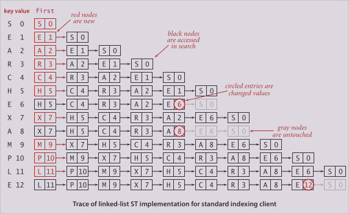


<a id="orgaccfd36"></a>

### implement

Just give the core code,key.equals() need to be implement before put into ths SequentialSearchST.

```java
public class SequentialSearchST<Key, Value>
{
    private Node first;
// first node in the linked list
    private class Node
    { // linked-list node
        Key key;
        Value val;
        Node next;
        public Node(Key key, Value val, Node next)
            {
                this.key = key;
                this.val = val;
                this.next = next;
            }
    }
    public Value get(Key key)
        { // Search for key, return associated value.
            for (Node x = first; x != null; x = x.next)
                if (key.equals(x.key))
                    return x.val;
// search hit
            return null;
// search miss
        }
    public void put(Key key, Value val)
        { // Search for key. Update value if found; grow table if new.
            for (Node x = first; x != null; x = x.next)
                if (key.equals(x.key))
                { x.val = val; return; }
// Search hit: update val.
            first = new Node(key, val, first); // Search miss: add new node.
        }
}
```

Inserting or Search N distinct keys into an initially empty linked-list symbol table uses~\[N^{2}/2\] compares A linked-list implementation with sequential search is too slow for it to be used to solve huge problems.


<a id="orgab1abbe"></a>

## Binary search in an ordered array

Now, we consider a full implementation of our ordered symbol-table API. The underlying data structure is a pair of parallel arrays,one for the keys and one for the values. Keeps Comparable keys in order in the array,then uses array indexing to enable fast implementation of **get()** and other operations. The heart of the implementation is the rank() method,which returns the number of keys smaller than a given key. For get(),the rank tell us precisely where the key is to be found if it is in the table(and, if it is not there,that it is not in the table). For put(), the rank tell us precisely where to update the value when the key is in the table,and precisely where to put the key when the key is not in the table. We move all larger keys over one position to make room(working from back to front) and insert the given key and value into the proper positions in their respective arrays. Again,studing BinarySearchST in conjunction with a trace of out test client is an instructive introduction to the data structure. This code maintains parallel arrays of keys and values.This code carries the inconvenience of having to create a Key array of type Comparable and a Value array of type Object,and to cast them back to Key[] and Value[] in the consturctor, As usual,we can use array resizing so that clients do not have to be concerned with the size of the array. But this method is too slow to use with large arrays.

```java
public class BinarySearchST<Key extends Comparable<Key>, Value>
{
    private Key[] keys;
    private Value[] vals;
    private int N;
    public BinarySearchST(int capacity)
        {
            // See Algorithm 1.1 for standard array-resizing code.
            keys = (Key[]) new Comparable[capacity];
            vals = (Value[]) new Object[capacity];
        }
    public int size()
        { return N; }
    public Value get(Key key)
        {
            if (isEmpty()) return null;
            int i = rank(key);
            if (i < N && keys[i].compareTo(key) == 0) return vals[i];
            else
                return null;
        }
    public int rank(Key key){
        if (hi<lo) return lo;
        int mid = lo+(hi-lo)/2;
        int cmp = key.compareTo(keys[mid]);
        if (cmp <0)
            return rank(key,lo,mid-1);
        else if(cmp>0)
            return rank(key,mid+1,hi);
        else return mid;

    }
    public void put(Key key, Value val)
        { // Search for key. Update value if found; grow table if new.
            int i = rank(key);
            if (i < N && keys[i].compareTo(key) == 0)
            { vals[i] = val; return; }
            for (int j = N; j > i; j--)
            { keys[j] = keys[j-1]; vals[j] = vals[j-1]; }
            keys[i] = key; vals[i] = val;
            N++;
        }
    //public void delete(Key key)
    // See Exercise 3.1.16 for this method.
}
```

```java
public int rank(key key){
    int lo=0,hi=N-1;
    while(lo<=hi){
        int mid = lo+(hi-lo)/2;
        int cmp = key.compareTo(keys[mid]);
        if (cmp<0) hi = mid-1;
        else if (cmp > 0) lo = mid+1;
        else return mid;
    }
    return lo;
}
```


<a id="org6b3e251"></a>

### Analysis of binary search

Binary search is typically far better than sequential search and is the method for choice in numerous pratical applications.For a static table(with no insert operations allowed).Typical modern search clients require symbol table that can support fast implementations of both search and insert. We need to be able to build huge tables where we can insert(and perhaps remove) key-value pairs in unpredictable patterns,intermixed with searches.


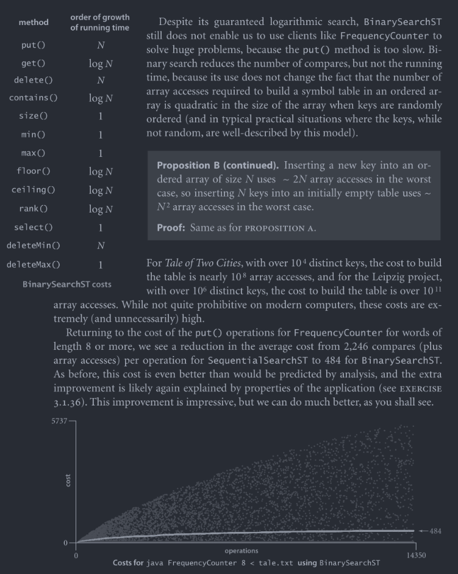


<a id="org3562fb3"></a>

## Binary search trees

A binary search tree(BST) is a binary tree where each node has a Comparable key (and an associated value) and satisfies the restriction that the key in any node is larger than the keys in all nodes in that node\`s left subtree and smaller than the key in all nodes in that nodes right subtree

```java
public class BST<Key extends Comparable<Key>,Value>
{
    private Node root;
    private class Node{
        private Key key;
        private Value val;
        private Node left,right;
        private int N;
        public Node(Key key,Value val,int N){
            this.key=key;
            this.val = val;
            this.N=N;
        }
    }

    public int size(){
        return size(root);
    }
    private int size(Node x){
        if (x==null)
            return 0;
        else
            return x.N;
    }
    public Value get(Key key){
        return get(root,key);
    }

    private Value get(Node x,Key key){
        if (x==null)
            return null;
        int cmp = key.compareTo(x.key);
        if (cmp <0)
            return get(x.left,key);
        else if (cmp >0)
            return get(x.right,key);
        else
            return x.val;
    }

    public void put(Key key,Value val){
        root = put(root,key,val);
    }

    private Node put(Node x,Key key,Value val){
        if(x==null)
            return new Node(key,val,1);
        int cmp = key.compareTo(x.key);
        if (cmp<0)
            x.left = put(x.left,key,val);
        else if(cmp>0)
            x.right = put(x.right,key,val);
        else
            x.val = val;
        x.N = size(x.left) + size(x.right) + 1;
        return x;

    }
}
```


<a id="orgc5f346a"></a>

### Analysis

The running times of algorithms on binary search trees depend on the shape of the trees,which in turn,depend on the order in which keys are inserted.In the best case,a tree with N nodes could be perfectly balanced,wich~lgN nodes between the rott and each null link. In the worst case there could be N nodes on the search path.The balance in typical trees turns out to be much closer to the best case than the worst case.


<a id="org251974c"></a>

### Summary

BSTs are not diffcult to implement and can provide fast search and insert for practical applications of all kinds if the key insertions are well-approximated by the random-key model. BSTs symbol-table implementations also support fast rank,select,delete,and range query operations.Still,as we have emphasized,the bad worst-case performance of BSTs may not be tolerable in some situations.


<a id="org72c7cc1"></a>

## Balanced Search Trees

The algorithms in the previous section work well for a wide variety of applications,but they have poor worst-case performance, We introduce in the section a type of binary search tree where costs are guaranteed to be logarithmic,no matter what sequence of keys is used to construct them.Ideally we would like to keep out binary search trees perfectly balanced. In an N-node tree,we would like the height to be ~lgN so that we can guarantee that all searches can be completed in ~lgN compares,just as for binary search. Unfortunately,maintaining perfect balance for dynamic insertions is too expensive. In this section, we consider a data structure that slightly relaxes the perfect balance requirement to provide guaranteed logarithmic performance not just for the insert and search operations in out symbol-table API but also for all of the ordered operations(except range search)


<a id="org9f0442f"></a>

### "2-3 search trees"

The primary step to get the flexibility that we need to guarantee balance in search trees is to allow the nodes in out trees to hold more than one key. Specifically,referring to the nodes in a standard BST as 2-nodes(they hold two links and one key),we now also allow 3-nodes,which hold tree links and two keys. Both 2-nodes and 3-node have one link for each of interval subtended by its keys.

 A perfectly balanced 2-3 search tree is one whose null links are all the same distance from the root. To be concise, we use the term "2-3 tree" to refer to a perfectly balanced "2-3 search tree". Later, we shall see efficient ways to define and implement the basic operations on 2-nodes,3-nodes,and "2-3 trees";for now,let us assume that we can manipulate them conveniently and see how we can use them as search trees.

1.  search

    The search algorithm for keys in a 2-3 tree directly generalizes the search algorithm for BSTs.To determine whether a key is in the tree,we compare it against the keys at the root.If it is equal to any of them,we have a search hit;otherwise we follow the link from the root to the subtree corresponding to the interval of key values that could contain the search key. If that link is null,we have a search miss;otherwise we recursively search in that subtree

    

2.  Insert into a 2-node

    To insert a new node in a 2-3 tree,we might do an unsuccessfull search and then hook on the node at the bottom,as we did with BSTs,but the new tree would not remain perfectly balanced.The primary reason that "2-3 trees" are useful is that we can do insertions and till maintain perfect balance.It is easy to accomplish this task if the node at which the search terminates is a 2-node:we just replace the node with a 3-node containing its key and the new key to be inserted. If the node where the search terminates is a 3-node,we have more work to do.

    

3.  Insert into a tree consisting of a single 3-node

    As a first warmup before considering the general case,suppose that we want to insert into a tiny "2-3 tree" consisting of just a single 3-node.Such a tree has two keys,but no room for a new key in its one node.To be able to perform the insertion,we temporarily put the new key into a 4-node,a natural extension of out node type that has tree keys and four links.Creating the 4-node is convenient because it is easy to convert it into a "2-3 tree" made up of three 2-nodes,one with the middle key(at the root),one with the smallest of the tree keys(pointed to by the left link of the root),and one with the largest of the tree keys(pointed to by the right link of the root).Such a tree is a 3-node BST and also a perfectly balanced 2-3 search tree,with all the null links at the same distance from the root.Before the insertion,the height of the tree is 0;after the insertion,the height of the tree is 1.This case is simple,but worth considering because it illustrates height growth in "2-3 trees"

    

4.  Insert into a 3-node whose parent is a 2-node

    As a second warmup,suppose that the search ends at a 3-node at the bottom whose parent is a 2-node. In this case,we can still make room for the new key while maintaining perfect balance in the tree,by making a temporary 4-node as just described, then splitting the 4-node as just described,but then,instead of creating a new node to hold the middle key,moving the middle key to the node\`s parent by the middle key with links on either side to the new 2-nodes. By our assumption,there is room for doing so in the parent:the parent was a 2-node(with two keys and tree links).Also,this transformation does not affect the defining properties of (perfectly balanced) "2-3 trees". The tree remains ordered because the middle key is moved to the parent,and it remains perfectly balanced:if all null links are the samce distance from the root before the insertion,they are all the same distance from the root after the insertion.Be centain that you understand this transformation&#x2013;it is the crux of 2-3 tree dynamics.

    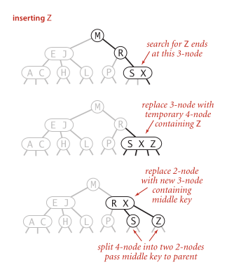

5.  Insert into a 3-node whose parent is a 3-node

    Now suppose that the search ends at a node whose parent is a 3-node.Again,we make a temporary 4-node as just described,then split it and insert its middle key into the parent.The parent was 3-node,so we replace it with a temporary new 4-node containing the middle key from the 4-node split.Then,we perform precisely the same transformation on that node.That is,we split the new 4-node and insert its middle key into its parent.Extending to the general case is clear: we continue up the tree,splitting 4-nodes and inserting their middle keys in their parent until reaching a 2-node,which we replace with a 3-node that does not need to be further split,or until reaching a 3-node at the root.

    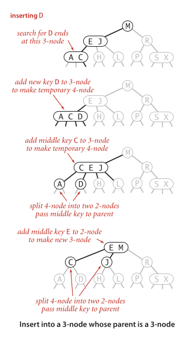

6.  Splitting the root.

    If we have 3-nodes along the whole path from the insertion point to the root,we end up with a temporary 4-node at the root. In this case we can proceed in precisely the same way as for insertion into a tree consisting of a single 3-node.We split the temporary 4-node into tree 2-nodes,increasing the height of tree by 1.Note that this last transformation preserves perfect balance because it is performed at the root.

    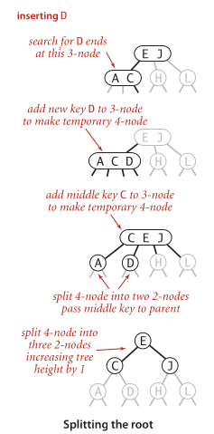

7.  Local transformation

    Splitting a temporary 4-node in a 2-3 tree involves one of six transformations,summarized at the bottom of the next page.The 4-node may be the root;it may be the left child,middle child,or right child of a 3-node.Ths basis of the "2-3 tree" insertion algorithm is that all of these transformations are purely local:no part of the tree needs to be examind or modified other than the specified nodes and links.The number of links changed for each transformation is bounded by a small constant.In particular,the transformations are effective when we find the specified patterns anywhere in the tree,not just at the bottom.Each of the transformations passes up one of the keys from a 4-node to that node\`s parent in the tree and then restructures links accordingly,without touching any other part of the tree.

    

8.  Global properties

    Moreover,these local transformations preserve the global properties that the tree is ordered and perfectly balanced:the number of links on the path from the root to any null link is the same. For reference,a complete diagram illustrating the point for the case that the 4-node is the middle child of a 3-node is shown above.If the length of every path from a root to a null link is h before the transformation,then it is h after the transformation.Each transformation preserves this property,even while splitting the 4-node into two 2-nodes and while changing the parent from a 2-node to a 3-node or from a 3-node into a temporary 4-node.When the root splits into three 2-node, the length of every path from the root to a null link increase by 1.If you are not fully convinced,work EXERCISE3.3.7,which asks you to extend a diagrams at the top of the previous page for the other five cases to illustrate the same point.Understanding that every local transformation preserves order and perfect balance in the whole tree is the key to understanding the algorithm.

     **UNLIKE STANDARD BSTS**,which grow down from the top,2-3 trees grow up from the bottom.

    

     The total cost of any search of insert is guaranteed to be logarithmic.


<a id="org632900e"></a>

## Red-black BSTs

Finally come to this section.The insertion algorithm for 2-3 trees just described is not diffcult to understand;now,we will see that it is also not diffcult to implement.We will consider a simple representation known as a red-black BST that leads to a natural implementation.


<a id="orgf4473ab"></a>

### Encoding 3-nodes

The basic idea behind red-black BSTs is to encode 2-3 trees by starting with standard BSTs(which are made up of 2-nodes) and adding extra information to encode 3-nodes.We think of the links as being of two different types:red links,which bind together two 2-nodes to represent 3-nodes,and black links,which bind together 2-3 tree. Specifically,we represent 3-nodes as two 2-nodes connected by a single red link tha leans left(one of the 2-nodes is the left child of the other).One advantage of using such a representation is that it allows us to use out get() code for standard BST search without modification.Given any 2-3 tree,we can immediately derive a corresponding BST,just by converting each node as specified.We refer to BSTs that represent 2-3 tree in this way as **red-black BSTs**.


<a id="orgc63f4e8"></a>

### An equivalent definition

Another way to proceed is to define **red-black BSTs** as BSTs having red and black links and satisfying the following three restrictions:

-   Red links lean left.
-   No node has two red links connected to it.
-   The tree has perfect black balance: every path from the root to a null link has the same number of black links.


<a id="orgb2aa4f7"></a>

### A 1-1 correspondence

If we draw the red links horizontally in a red-black BST,all of the null links are the same distance from the root,and if we then collapse together the nodes connected by red links,the result is a 2-3 tree.Conversely,if we draw 3-nodes in a 2-3 tree as two 2-nodes connected by a red link that leans left,then no node has two red links connected to it,and the tree has perfect black balance,since the black links correspond to the 2-3 tree links,which are perfectly balanced by definition.Whichever way we choose to define them,red-black BSTs are both BSTs and 2-3 trees.


<a id="orgd40b80c"></a>

### color representation

For convenience,since each node is pointed to by precisely one link(from its parent),we encode the color of links in nodes,by adding a boolean instance variable color to out Node data type

-   **true:** the link from the parent is red
-   **false:** the link from the parent is black

for clarity in out code,we define constants **RED** and **BLACK** for use in setting and test this variable. We use a private method isRed() to test the color of a node\`s link to its parent. When we refer to the color of a node,we are referring to the color of the link pointing to it,and vice versa.


```java
private static final boolean RED = true;
private static final boolean RED = false;

private class Node{
Key key; //key
Value val; //associated data
Node left,right;//subtrees
int N;//nodes in this subtree
boolean color; // color of link from parent to this node
Node(Key key,Value val,int N,boolean color){
    this.key = key;
    this.val = val;
    this.N = N;
    this.color = color;
}

private boolean isRed(Node x){
    if(x==null)
        return false;
    return x.color == RED;
}
}

```


<a id="org73f6377"></a>

### Rotations

The implementation that we will consider might allow right-leaning red links or two red links in a row during an operation,but it always corrects these conditions before completion,through judicious use of an operation called rotation that switches the orientation of red links. First,suppose that we have a right-leaning red link that needs to be rotated to lean to the left. This operation is called a *left rotation*. We organize the computation as a method that takes a link to the red-black BST as argument and,assuming that link to be a Node h whose right link is red,makes the necessary adjustments and returns a link to a node that is the rooot of a red-black BST for the same set of keys whose left link is red. if you check each of the lines of code against the before/after drawing in the diagram.you will find this operation is easy to understand: we are switching from having the smaller of the two keys at the root to having the larger of the two keys at the root.Implementing a right rotation that convert a left-leaning red link to a right-leaning one amounts to the same code,with left and right interchanged

|                                                           |                                                           |                                                              |
|---------------------------------------------------------- |---------------------------------------------------------- |------------------------------------------------------------- |
| 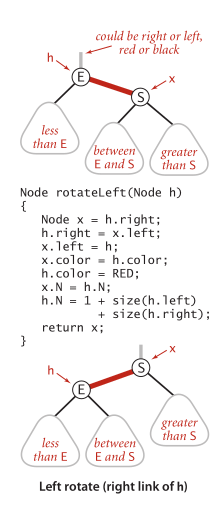 | 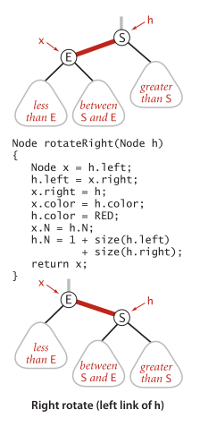 | ****\***** Resetting the link in the parent after a rotation. |

Whether left or right,every rotation leaves us with a link. We always use the link returned by **rotateRight()** or **rotateLeft()** to reset the appropriate link in the parent(or the root of the tree). That may be right or left link,but we can always use it to reset the link in the parent. This link may be red or black&#x2013;both rotateLeft() and rotateRight() preserve its color by setting x.color to h.color.This might allow two red links in a row to occur within the tree, but out algorithms will also use ratations to correct this condition when it arises.For example,the code

```java
h = rorateLeft(h);
```

roates left a right-leaning red link that is to the right of node h,setting h to point to the root of the resulting subtree(which contains all the same nodes as the subtree pointed to by h before the rotation,but a different root).The ease of writing this type of code is the primary reason we use recursive implementions of BST methods,as it makes doing rotations an easy supplement to normal insertion,as you will see. **WE CAN USE ROTATIONS** to help maintain the 1-1 correspondence between 2-3 trees and red-black BSTs as new keys are inserted because they preserve the two defining properties of red-black BSTs: order and perfect black balance. That is,we can use rotations on a red-black BST without having to worry about losing its order or its perfect black balance.


<a id="orgfd4c139"></a>

### Insert into a single 2-node.

A red-blaco BST with 1 key is just a single 2-node.Inserting the second key immediately shows the need for having a rotation operation.

-   If the new key is smaller than the key in the tree,we just make new(red) node with the new key and we are done: we have a red-black BST that is equivalent to a single 3-node
-   if the new key is larger than the key in the tree,then attach a new (red) node gives a right-leaning red link,and the code root=leftRotate(root); completes the rotation by rotating the red link to the left and update the root link.

The result in both case is the red-black representation of a single 3-node,with two keys,one left-leaning red link,and black height 1

|                                                           |                                                           |
|---------------------------------------------------------- |---------------------------------------------------------- |
|  |  |


<a id="org358b925"></a>

### Insert into a two node at the bottom.

We insert keys into a red-black BST as usual into a BST,adding a new node at the bottom(respecting the order),but always connected to its parent with a red link. If the parent is a 2-node,then the same two case just discussed are effective. If the new node attached to the left link,the parent simply becomes a 3-node;if it is attached to a right link,we have a 3-node leaning the wrong way,but left rotation finishes the job.


<a id="org6a778ee"></a>

### Insert into a tree with two keys(in a 3-node)

This case reduce to three subcases:

-   the new key is either less than both keys in the tree
-   between than
-   greeter than both of them

Each of the cases introduces a node with two red links connected to it;out goal is to correct this condition.

-   **the new key is larger than the two keys in the tree:** The simplest of the three cases.Attach it on the rightmost link of the 3-node,making a balanced tree with the middle key at the root,connected with red links to nodes containing a smaller and a larger key.If we flip the colors of those two links from red to black, then we have a balanced tree of height 2 with three nodes,exactly what we need to maintain out 1-1 correspondence to 2-3 trees.The other two cases eventually reduce to the case.
-   **the new key is smaller than the two keys in the tree:** the key will goes on the left link,then we have two red links in a row,both leaning to the left,which we can reduce to the previous case(middle key at the root,connected to the others by two red links) by rotating the top link to the right(right rotation)
-   **the new key goes between the two keys in the tree:** we again have two red links in a row,right-leaning one below a left-leaning one,which we can reduce to the previous case (two red links a row,to the left) by rotating left the bottom link

In summary,we achieve the desired result by doing zero,one,or two rotations followed by flipping the colors of the two children of the root.As with 2-3 trees,be certain that you understand these transformations as they are key to red-black tree dynamics.

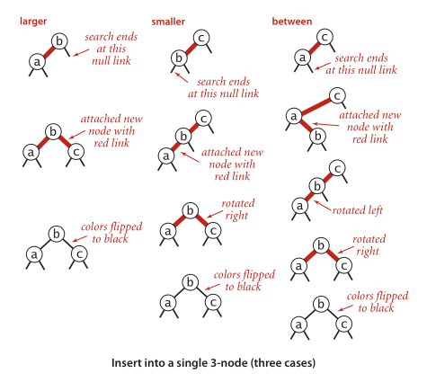


<a id="org9afb471"></a>

### Flipping color

To flip the colors of the two red children of a node,we use a method flipColors(),shown at left. In addition to flipping the colors of the children from red to black,we also flip the color of the parent from black to red.A critically important characteristic of this operation is that,like rotations,it is a local transformation that preserve perfect black balance in the tree. Moreover, this convention immediately leads us to a full implementation,as we describe next.

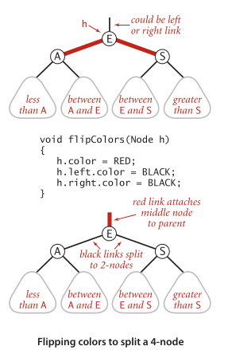


<a id="orga007f9b"></a>

### Keeping the root black.

In the case just considered(insert into a single 3-node),the color flip will color the root red.This can also happen in larger trees.Strickly speaking,a red root implies that the root is part of a 3-node,but that is not the case,so we color the root black after each insertion.Note that the black height of the tree increases by 1 whenever the color of the color of the root is flipped from black to red.


<a id="org825980f"></a>

### Insert into a 3-node at the bottom.

Now suppose that we add the new node at the bottom that is connected to a 3-node.The same 3 case just discussed arise.Either the new link is connected to the right link of the 3-node(in which case we just flip color) or to the left link of the 3-node (in which case we need to rotate the top link to right and flip colors) or to the middle link of the 3-node(in which case,we rotate left the top link,then flip colors). Flipping the colors makes the link to the middle node red,which amounts to passing it up to is parent,putting us back in the same situation with respect to the parent,which we can fix by moving up the tree.


<a id="orge6ca549"></a>

### Passing a red link up the tree.

The 2-3 tree insertion algorithm calls for split a 3-node,passing the middle key up to be inserted into its parent,continuing until encountering a 2-node or the root.In every cases we have considered,we precisely accomplish this objective: after doing any necessary rotations,we flip colors,which turns the middle node to red.From the point of view of the parent of that node,that link become red can be handled in precisely the same manner as if the red link came from attaching a new node: we pass up a red link to the middle node.The three case summarized in the diagram on the next page precisely capture the operations necessary in a red-black tree to implement the key operation in 2-3 tree insertion:to insert into a 3-node,create a temporary 4-node,split it ,and pass the red link to the middle key up to its parent.Continuing the same process,we pass the red link up the tree until reaching a 2-node or the root.

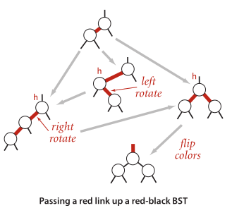 **IN SUMMARY, WE CAN MAINTAIN** our 1-1 correspondence between 2-3 trees and red-black BSTs during insertion by judicious use of tree simple operations: left rotate,right rotate,and color flip.We can accomplish the insertion by performing the following operations,one after the other,on each node as we pass up the tree from the point of insertion:

-   if the right child is red and left child is black,rotate left
-   if both the left child and its left child is red,rotate right.
-   if both childred are red,flip colors.

It certainly is worth you while to check that this sequence handles each of the cases just described.Note that the first operation handles the rotation necessary to lean the 3-node to the left when the parent is a 2-node and the rotation necessary to lean the bottom link to the left when the new red link is the middle link in a 3-node.


<a id="org534d228"></a>

### Implement

```java
public class RedBlackBST<Key extends Comparable<Key>,Value>
{
    private Node root;
    private class Node;//BST node with color bit
    private boolean isRed(Node h);
    private Node rotateLeft(Node h);
    private Node rotateRight(Node h);
    private void flipColors(Node h);

    private int size();

    public void put(Key key,Value val){
        root = put(root,key,val);
        root.color = BLACK;
    }
    private Node put(Node h,Key key,Value val){
        if (h==null)
            return new Node(Key,val,1,RED);
        int cmp = key.compareTo(h.key);
        if (cmp <0)
            h.left= put(h.left,key,val);
        else if(cmp>0)
            h.right = put(h.right,key,val);
        else
            h.val = val;
        if(isRed(h.right) && !isRed(h.left))
            h=rotateLeft(h);
        if(isRed(h.left) && isRed(h.left.left))
            h = rotateRight(h);
        if(isRed(h.left) && isRed(h.right))
            flipColors(h);
        h.N = size(h.left)+size(h.right)+1;
        return h;
    }
}
```


<a id="org8c076ac"></a>

### Deletion

Since put() in ALGORITHM 3.4 is already one of the most intricate methods that we consider in this book,and the implementations of deleteMin(),deleteMax(),delete() for red-black BSTs are a bit more complicated.

1.  Top-down 2-3-4 trees

    As first warmup for deletion,we consider a simpler algorithm that does the transformations both on the way down the path and on the way up the path: an insertion algorithm for 2-3-4 trees, where the temporary 4-nodes that we saw in 2-3 trees can persist in the tree.The insertion algorithm is based on doing transformation on the way down the path to maintain the invarient that the current node is not a 4-node(so we assured that where will be room to insert the new key at the bottom)and transformation on the way up the path to balance any 4-nodes that may be created.The transformation on the way down are precisely the same transformations that we used for splitting 4-nodes in 2-3 trees.If the root is a 4-node,we split it into 3 2-nodes,increasing the height of the tree by 1. On the way down the tree,if we encounter a 4-node with a 2-node as parent,we split the 4-node into two 2-nodes and pass the middle key to parent,making it a 3-node;if we encounter a 4-node with a 3-node as parent,we split the 4-node into 2-node and pass the middle key to the parent,making it a 4-node.We do not need to warry about encountering a 4-node with a 4-node as parent by virtue of the invarient. At the bottom,we have,again by virtue of the invarient,a 2-node or a 3-node,so we have room to insert the new key,To implement this algorithm with red-black BSTs,we

    -   Represent 4-nodes as a balanced subtree of three 2-nodes,with both the left and right child connected to the parent with a red link
    -   Split 4-nodes on the way down the tree with color flips
    -   Balance 4-node on the way up the tree with rotations,as for insertion 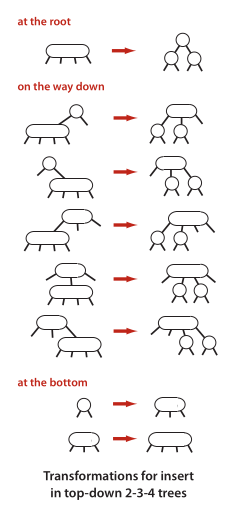

    Remarkably,you can implement top-town 2-3-4 trees by moving one line of code in put() in ALGORITHM 3.4: move the colorFlip() call (and accompanying test) to before the recursive calls(between the test for null and the comparison). This algorithm has some advantages over 2-3 trees in applications multiple processes have access to the same tree,because it always is operating within a link or two of the current node.The delection algorithm that we describe next are based on a similar scheme and are effective for these trees as well as for 2-3 trees.
